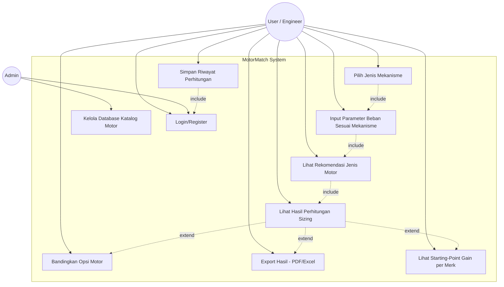
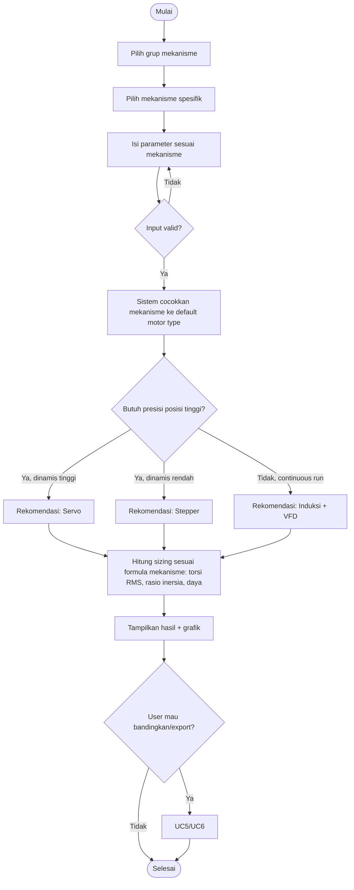
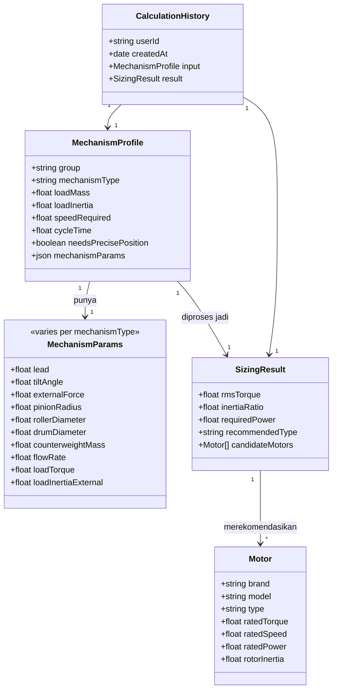

# MotorMatch — Dokumen Perancangan Software

Web app untuk membantu user memilih jenis motor (servo / stepper / induksi-VFD) berdasarkan **jenis mekanisme** (mengacu pada referensi mekanisme Mitsubishi: ball screw, rack & pinion, roll feed, rotary table, cart, elevator/hoist, conveyor, fan, pump, generic rotary, generic linear, linear servo) dan parameter beban, lalu memberikan rekomendasi sizing.

---

## 1. Deskripsi Umum

| Item | Keterangan |
|---|---|
| Nama produk | MotorMatch |
| Platform | Web app (Next.js + TypeScript) |
| Tujuan | Membantu engineer memilih & sizing motor yang tepat berdasarkan jenis gerak dan parameter mekanis |
| User utama | Automation/mechanical engineer, mahasiswa, technical sales motor/drive |

---

## 1a. Value Proposition / Differentiator

Dibanding tools sizing komersial (SEW Sizer, Mitsubishi Capacity Selection, dll) yang biasanya vendor-locked dan berhenti di "beli motor ini":

| Diferensiator | Penjelasan |
|---|---|
| **Brand-agnostic** | Hasil sizing di-matching ke beberapa merk sekaligus (Mitsubishi, INVT, Baumüller, dll), user bisa bandingkan lintas vendor, tidak terkunci satu katalog |
| **Transparan (bukan black-box)** | Langkah perhitungan (formula torsi RMS, rasio inersia) ditampilkan eksplisit — sekaligus jadi alat belajar, bukan cuma kalkulator kotak hitam |
| **Sizing → Starting-Point Gain Calculator** | Setelah motor terpilih, sistem hitung starting-point gain servo generik (berbasis rasio inersia load/rotor + rigidity/bandwidth yang diinginkan) menggunakan teori kontrol universal (cascade P-PI), lalu tampilkan hasil dalam beberapa "dialek" merk (mis. Kv rad/s ala Baumüller, gain level ala Mitsubishi). **Bukan live auto-tuning ke drive asli** — itu di luar scope MVP karena beda protokol komunikasi per merk (Modbus/proprietary) dan berisiko scope creep |
| **Konteks lokal Indonesia** | Ketersediaan part di pasar lokal, referensi distributor |
| **Studi kasus lapangan nyata** | Contoh kasus dari pengalaman riil (conveyor, web guiding, dll) sebagai referensi/template |

Catatan scope: live tuning (connect real-time ke drive fisik) berpotensi jadi fase jauh ke depan (v3/v4), bukan bagian MVP maupun fase 2-4 di roadmap saat ini.

---

1. **User (Engineer)** — aktor utama, input parameter dan menerima rekomendasi
2. **Admin** — mengelola database katalog motor (opsional, fase lanjut)
3. **Sistem (Calculation Engine)** — aktor pendukung, menjalankan logika kalkulasi sizing

---

## 3. Use Case Diagram

---

## 4. Deskripsi Use Case (Utama)

### UC1 — Pilih Jenis Mekanisme
| | |
|---|---|
| Aktor | User |
| Deskripsi | User memilih mekanisme spesifik yang dipakai, dikelompokkan dalam 4 grup besar (referensi Mitsubishi) |
| Pre-condition | User membuka halaman wizard |
| Main flow | 1. User buka halaman input → 2. Sistem tampilkan 4 grup mekanisme → 3. User pilih grup → 4. Sistem tampilkan pilihan mekanisme spesifik dalam grup → 5. User pilih salah satu → 6. Sistem tampilkan form parameter sesuai mekanisme terpilih |
| Post-condition | Mekanisme tersimpan di session, lanjut ke UC2 |

**Grup & mekanisme:**

| Grup | Mekanisme | Parameter khas |
|---|---|---|
| **Linear Motion** | Ball screw | lead (Pb), sudut kemiringan (θ), massa beban (Wl), gaya eksternal (Fc) |
| | Rack and pinion | radius pinion (Cr), sudut kemiringan (θ), gaya tarik (Ft) |
| | Roll feed | diameter roll (Dra/Drb), gaya jepit (Fn) |
| | Sprocket & chain | diameter pitch sprocket (D), gaya tarik (F), berat beban — koefisien gesekan lebih tinggi dari ballscrew |
| | Conveyor (belt) | diameter roller (Cr), sudut kemiringan, berat beban (Wl) |
| | Cart | diameter roda (Dwh), lebar cart (Wcart), berat beban (Wl) |
| | Linear servo | gaya friksi (Ff), gaya cutting (Fc), berat traveler (Wt), kecepatan (V) |
| | Generic (linear) | gaya (Fc), kecepatan (V), berat beban (Wl) |
| **Rotary Indexing** | Rotary table | diameter meja (Dt), radius beban (R), berat beban (Wl) |
| **Rotary Continuous** | Fan | debit udara (Q), inersia fan (Jf) |
| | Pump | debit fluida (Q), inersia pump (Jp) |
| | Generic (rotary) | torsi beban (Tc), inersia load (Jl) |
| **Vertical/Hoisting** | Elevator/hoist | diameter drum (Ds), berat counterweight (Wcw), berat beban (Wl), gaya (Fc) |

### UC2 — Input Parameter Beban Sesuai Mekanisme
| | |
|---|---|
| Aktor | User |
| Deskripsi | User mengisi parameter mekanis spesifik sesuai mekanisme yang dipilih di UC1 (lihat tabel parameter di atas), ditambah parameter umum: kecepatan, waktu siklus, duty cycle, kebutuhan presisi posisi |
| Main flow | 1. Sistem tampilkan form dinamis sesuai mekanisme UC1 (field & simbol variabel sesuai gambar referensi) → 2. User isi parameter → 3. Sistem validasi input (range, satuan) → 4. User submit |
| Alternate flow | Jika parameter tidak valid → sistem tampilkan pesan error, user perbaiki input |
| Post-condition | Data parameter siap diproses UC3 |

### UC3 — Lihat Rekomendasi Jenis Motor
| | |
|---|---|
| Aktor | User, Sistem |
| Deskripsi | Sistem menjalankan logika keputusan (decision tree) untuk merekomendasikan servo / stepper / induksi-VFD, berdasarkan mekanisme (UC1) + kebutuhan presisi & dinamika (UC2) |
| Main flow | 1. Sistem proses parameter dari UC2 → 2. Sistem cocokkan mekanisme dengan aturan default (mis. Fan/Pump/Conveyor → cenderung induksi+VFD; Ball screw/Linear servo/Rotary table → cenderung servo) → 3. Sistem sesuaikan lagi dengan kebutuhan presisi posisi dari user → 4. Sistem tampilkan rekomendasi jenis motor beserta alasan |
| Post-condition | Rekomendasi jenis motor ditampilkan, lanjut ke UC4 |

### UC4 — Lihat Hasil Perhitungan Sizing
| | |
|---|---|
| Aktor | User, Sistem |
| Deskripsi | Sistem menghitung nilai teknis: torsi RMS, rasio inersia load/rotor, kecepatan rated, daya motor |
| Main flow | 1. Sistem ambil jenis motor dari UC3 → 2. Sistem hitung torsi/kecepatan/daya sesuai formula per jenis motor → 3. Sistem tampilkan hasil beserta grafik profil torsi-kecepatan-waktu |
| Post-condition | Hasil sizing lengkap ditampilkan |

### UC5 — Bandingkan Opsi Motor
| | |
|---|---|
| Aktor | User |
| Deskripsi | User membandingkan 2-3 kandidat motor (dari katalog) berdasarkan hasil sizing |
| Extend dari | UC4 |

### UC6 — Export Hasil
| | |
|---|---|
| Aktor | User |
| Deskripsi | User export hasil perhitungan ke PDF/Excel untuk dokumentasi |
| Extend dari | UC4 |

### UC7 — Simpan Riwayat Perhitungan
| | |
|---|---|
| Aktor | User |
| Deskripsi | User (login) dapat menyimpan & membuka kembali hasil perhitungan sebelumnya |
| Include | UC9 (Login) |

### UC8 — Kelola Database Katalog Motor
| | |
|---|---|
| Aktor | Admin |
| Deskripsi | Admin tambah/edit/hapus data motor (merk, tipe, spesifikasi) yang dipakai sistem untuk matching di UC5 |

### UC10 — Lihat Starting-Point Gain per Merk
| | |
|---|---|
| Aktor | User |
| Deskripsi | Untuk hasil rekomendasi servo, sistem hitung starting-point gain generik (Kv/Kp/Tn) berbasis rasio inersia load/rotor + rigidity/bandwidth target (teori cascade P-PI universal), lalu tampilkan dalam beberapa "dialek" merk (mis. Kv rad/s ala Baumüller, gain level ala Mitsubishi) |
| Extend dari | UC4 (hanya muncul jika rekomendasi = servo) |
| Batasan | Bukan live auto-tuning ke drive fisik — hanya starting-point kalkulasi offline |

---

## 5. Activity Diagram — Alur Utama (UC1→UC4)

---

## 6. Class Diagram / Data Model (draft)

---

## 7. Alur Halaman (Page Flow)

1. **Landing page** → penjelasan singkat + tombol "Mulai Hitung"
2. **Step 1a: Pilih Grup Mekanisme** (card selection: Linear Motion / Rotary Indexing / Rotary Continuous / Vertical-Hoisting)
3. **Step 1b: Pilih Mekanisme Spesifik** (card dengan ilustrasi mekanisme, mis. ball screw, conveyor, fan, dst — dalam grup terpilih)
4. **Step 2: Form Parameter** (dinamis sesuai mekanisme, field & simbol variabel mengikuti gambar referensi)
5. **Step 3: Hasil Rekomendasi** (jenis motor + alasan + grafik torsi-kecepatan)
6. **Step 4: Detail Sizing & Kandidat Motor** (tabel kandidat dari katalog, tombol bandingkan/export)
7. (Opsional) **Riwayat** — daftar hasil perhitungan tersimpan (butuh login)

---

## 8. Tahapan Pengembangan (Roadmap)

**Status (Agustus 2026):** Phase 1 (MVP) ✅ dan Phase 2 ✅ sudah selesai.

| Fase | Scope | Status |
|---|---|---|
| MVP (Phase 1) | UC1-UC4: Pilih mekanisme → Input → Rekomendasi → Sizing (13 mekanisme) | ✅ Done |
| Phase 2 | Motor catalog (37 entries) + Full RMS + Gain Calculator (UC10) | ✅ Done |
| Phase 3 | UC5 (Comparison View) + UC6 (Export PDF) | 📋 Planned |
| Phase 4 | Input Validation + Torque-Speed Charts + Diagrams untuk 9 mekanisme lainnya | 📋 Planned |
| Phase 5 | UC9 (Auth) + UC7 (History / Simpan Riwayat) | 📋 Planned |
| Phase 6 | UC8 (Admin Panel — CRUD katalog motor via UI) | 📋 Planned |
| Phase 7 | Advanced: Case Study Library, Cross-Reference, i18n | 📋 Future |
| Phase 8 | Live Auto-Tuning ke drive fisik (long-term) | ⚪ Far Future |

**Detail roadmap Phase 3 s/d Final:** Lihat `src/docs/roadmap-phase3-and-beyond.md`

---

Catatan: formula sizing detail (torsi RMS, rasio inersia, dsb.) ada di `motormatch-sizing-formulas.md`. Decision rules dan gain calculator ada di `motormatch-decision-rules-and-gain.md`.
